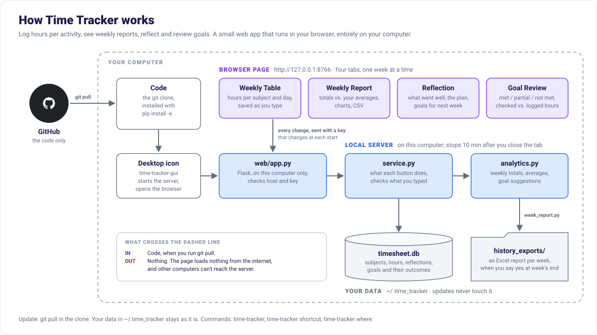

# Time Tracker

A personal time, progress and reflection tracker that runs in your browser, entirely on your
computer. No cloud account, no subscription: a small local web app (Flask + HTML/CSS/JavaScript)
backed by one SQLite file.



## What it does

Four tabs for the week you pick with **← Prev / Next →**, and one to import earlier Excel files:

| Tab | Purpose |
|---|---|
| **Weekly Table** | Type hours per activity, per day; each cell is saved when you leave it. Daily and weekly totals, Excel download. |
| **Weekly Report** | Totals, a comparison to your long-term averages, bar and trend charts, subject breakdown, CSV download. |
| **Reflection** | What went well, what could improve, the plan for next week, and goals for next week. |
| **Goal Review** | Evaluate the week's goals; goals linked to a subject are checked against the hours you logged. |
| **Import** | Read Excel files from earlier runs back in: one or many, with a preview of what changes. |

When a week with entries has ended, the app asks once whether to export that week's report to Excel.

## Code and data are kept apart

| | Where | Updated by |
|---|---|---|
| **Code** | this git clone, e.g. `D:\Programs\time-tracker` | `git pull` |
| **Your data** (`timesheet.db`, Excel reports, error log) | `~/.time_tracker` (Windows: `C:\Users\<you>\.time_tracker`) | the app |

So updating, re-cloning or deleting the clone never touches your data. Set the
`TIME_TRACKER_HOME` environment variable to use another folder. `time-tracker where` prints the paths.

## Install (once)

Windows PowerShell; on macOS/Linux use `python3` and `source .venv/bin/activate`.
If a conda `(base)` environment is active, run `conda deactivate` first.

```
git clone https://github.com/Fazel-AVB/time-tracker.git
cd time-tracker
py -m venv .venv
.venv\Scripts\activate
python -m pip install -e .
time-tracker shortcut
```

- `-e` (editable) makes the installed program run the code in this folder, so a later
  `git pull` takes effect without reinstalling.
- `time-tracker shortcut` puts a **Time Tracker** icon on your desktop. Double-click it to open
  the app. (By hand instead: in `.venv\Scripts`, right-click `time-tracker-gui.exe` → *Show more
  options* → *Send to* → *Desktop (create shortcut)*; then *Properties* → *Change Icon* → pick
  `tracker\web\static\time_tracker.ico` in the clone.)

## Update

```
cd D:\Programs\time-tracker      # your clone
.venv\Scripts\activate
git pull
```

That's all for a normal change: only the changed files are downloaded, and your data is not
touched. If `pyproject.toml` changed (new dependency or command), also run
`python -m pip install -e .`. It's harmless when nothing changed. If the app is open, press
**Quit** and start it again to load the new code.

### Coming from the Streamlit version (before 0.2)

1. Quit the old app (close its console window).
2. `git pull` in the same folder you used before, then run the [Install](#install-once) lines
   from `py -m venv .venv` onward. The old packages (Streamlit, Plotly)
   are no longer needed.
3. Delete the old desktop shortcut (it pointed at `launch.vbs`, which is gone). Use the new one.

On its first start the app copies your old `data\timesheet.db` from the clone to
`~/.time_tracker` and says so on the page. The old file stays where it was as a backup. If your
old data is somewhere else, e.g. a folder that wasn't a git clone, import it once:

```
time-tracker import-db "D:\old\time_tracker\data\timesheet.db"
```

Old Excel reports in the clone's `history_exports` folder stay there; new ones go to
`~/.time_tracker\history_exports`.

## Use

Double-click the desktop icon, or run `time-tracker` in the activated environment. The browser
opens on `http://127.0.0.1:8766`, which only this computer can reach. Starting it again while it
runs just reopens the page. To stop it, press **Quit**; it also stops by itself 10 minutes after
you close the tab. Errors are logged to `~/.time_tracker/gui.log`.

1. **Weekly Table → New subject**: type a subject, a low-level label (specific, e.g. *python*) and
   a high-level label (broad, e.g. *Work*). Earlier values are suggested as you type; ✕ removes
   one from the suggestions.
2. Type hours into the day cells. Subjects you used last week appear automatically.
3. **Weekly Report** compares the week to your average over the last 2–26 weeks, by high- or
   low-level label.
4. At the end of the week, write the **Reflection** and set goals for next week. Link a goal to a
   subject to have it evaluated automatically.
5. The following week, open **Goal Review** to mark each goal met, partial or not met.

Retyping a name or label in the table changes that row for the displayed week only; other weeks
keep the old one. 🗑 removes a row, and its hours, from the displayed week only. To delete a
subject everywhere, use **Manage subjects**.

## Import Excel files from earlier runs

The **Import** tab reads back the Excel files the app wrote before, from this version or the
Streamlit one:

- end-of-week reports, `time_report_<date>.xlsx`: hours with their notes, the reflection, and
  goals with their outcomes;
- table downloads, `timesheet_<date>.xlsx`: hours per subject and day.

Choose or drop one file or many. The week of each file comes from the dates inside it (the
report's Entries sheet), otherwise from the date in its name; if it has neither, the tab asks
you. Nothing changes until you press **Import**. First you see, per file, which days are new
and which are already there, and a chart of hours per week now vs after the import. Afterwards
the Weekly Table, Report and Goal Review include the imported weeks.

Importing the same file twice changes nothing: a day whose hours are already the same is left
alone. For a day where the app and the file disagree, you choose: keep the app's hours (the
default) or use the file's. Subjects are matched by name and labels, ignoring case, and created
when missing.

Old reports are usually in `~/.time_tracker\history_exports`, or in the clone's
`history_exports` folder for the Streamlit version. The tab shows the folders it finds.
From a terminal, a whole folder at once:

```
time-tracker import-excel "D:\Programs\time-tracker\history_exports" --dry-run   # only show what would change
time-tracker import-excel "D:\Programs\time-tracker\history_exports"
```

## Commands

```
time-tracker                    open the app (same as double-clicking the icon)
time-tracker gui --port 8800    use another port; --no-browser to not open a tab
time-tracker where              where the data is
time-tracker import-db FILE     use a copy of another timesheet.db (--force to replace yours; a backup is kept)
time-tracker import-excel PATH  add Excel reports from earlier runs; files or folders (--replace, --week, --dry-run)
time-tracker shortcut           (re)create the desktop icon
time-tracker --version
```

## Privacy

Nothing leaves your computer. The app serves its page on `127.0.0.1` only, loads nothing from the
internet, and requires a random key (new at every start) on every request, so websites open in
your browser can't read or change your data.

## Project layout

```
pyproject.toml            package definition; installs the time-tracker commands
tracker/
  models.py               dataclasses: Subject, TimeEntry, Reflection, Goal, GoalOutcome
  database.py             TimesheetDB: SQLite storage and schema migrations
  analytics.py            pure aggregation: weekly pivot, label totals, averages, goal evaluation
  suggestions.py          the New-subject suggestions and hidden values
  week_report.py          the end-of-week Excel workbook
  excel_import.py         reading those workbooks (and table downloads) back in
  seasonal.py             the seasonal banner's colours
  service.py              what each button does (used by the web app, unit-tested)
  paths.py                where the data lives (~/.time_tracker); moving data from older versions
  cli.py                  the time-tracker command
  shortcut.py             the desktop shortcut with the icon (Windows)
  web/
    launcher.py           start the local server, open the browser, stop when idle
    app.py                the JSON API on 127.0.0.1, with host and key checks
    static/               the page: index.html, app.js, charts.js, style.css, logo.svg, time_tracker.ico
tests/                    pytest, no browser needed
notebooks/                a walkthrough of the tracker functions on a demo database
docs/architecture.svg     the overview figure above (made by docs/make_figure.py)
```

## Tests

```
python -m pip install -e ".[dev]"
python -m pytest -q
```

## Data model

| Table | What it stores |
|---|---|
| `subjects` | Activities you track (name + low- and high-level label) |
| `time_entries` | Hours logged per subject per day |
| `reflections` | Weekly strengths / weaknesses / plan |
| `goals` | Goals for a week (optional target hours, optional subject link) |
| `goal_outcomes` | Evaluation of each goal (met / partial / not met + notes) |
| `week_subject_exclusions`, `week_subject_pins` | Rows removed from / added to one week's table |
| `week_exports`, `settings` | Answers to the export prompt, hidden suggestions |
